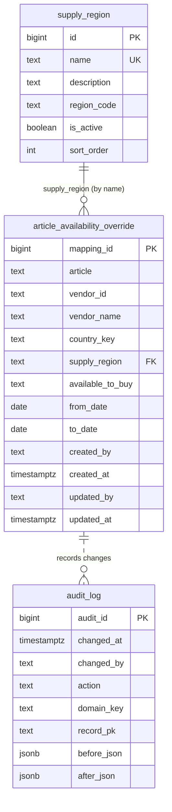

# Data Model — MDM Control Plane

The transactional store is **Lakebase** (serverless Postgres), schema **`mdm`**,
owned by the Databricks Apps service principal. There is one **reference-list**
table (the configurable dropdown), one **domain** table (the master data the app
maintains), and one **audit** table. The domain table is destined for Unity
Catalog for downstream consumers.

> This describes the seed domain — **Article Availability Override**. The app is
> config-driven: a new master-data domain is a registry entry plus a table on the
> same pattern, not a schema rewrite.

## The use case

Supply Chain Ops maintains a table that **overrides an article's "Available to
buy in SAP" status** for a given (Article, Supply Region, Vendor). The
availability value is **user-configurable (Yes / No, default No)** — entered
through the app per row.

Source example (from the business):

| Article | Supply Region | Vendor | Available to buy in SAP |
|---|---|---|---|
| 11383 | FNQ Cairns | 100109 | NO |

## Overview

The lookup relationship is **by value, not an enforced foreign key**: the domain
table stores the region's `name`, and referential integrity is enforced in the
application. This is deliberate — deactivating a reference option hides it from
new entries without breaking or rewriting existing rows.

---

## Reference list (configurable dropdown)

CRUD-managed data, not a hardcoded enum. Admins add / rename / deactivate options
through the **Manage lists** screen.

### `supply_region`
7-Eleven's supply territories. Seeded from the distinct supply-region codes in
the LFLR mapping; rename/enrich in-app as needed.

| Column | Type | Notes |
|---|---|---|
| `id` | `bigint` identity | PK |
| `name` | `text` | **unique**, not null — the value stored on overrides |
| `description` | `text` | free text |
| `region_code` | `text` | 7-Eleven region code |
| `is_active` | `boolean` | default `true`; inactive hides from new entries |
| `sort_order` | `int` | display order |

---

## Domain table — `article_availability_override`

One row = one (Article, Supply Region, Vendor) whose availability is overridden
to "No", over an effective window.

| Column | Type | Null | Notes |
|---|---|---|---|
| `mapping_id` | `bigint` identity | no | **PK**, surrogate, app-generated |
| `article` | `text` | no | SAP article number |
| `vendor_id` | `text` | no | SAP vendor number |
| `vendor_name` | `text` | yes | display name — **nullable/empty**, to be sourced from the SAP vendor master later; not entered or shown |
| `country_key` | `text` | no | SAP country key, default `AU` (carried from source, not entered) |
| `supply_region` | `text` | no | value from `supply_region.name` |
| `available_to_buy` | `text` | no | **user-configurable Yes / No** (default `No`); shown in the grid and editable in the form |
| `from_date` | `date` | no | effective start — app-set to today on create; hidden from the UI |
| `to_date` | `date` | yes | effective end (`null` = open-ended) — app-set to today on remove; hidden from the UI |
| `created_by` / `created_at` | `text` / `timestamptz` | | created attribution |
| `updated_by` / `updated_at` | `text` / `timestamptz` | | last-change attribution; surfaced in-grid |

### Business key & uniqueness
The **business key** is `(article, supply_region, vendor_id)`. The app rejects a
new/edited row whose effective window **overlaps** an existing row with the same
business key. This is the live "an overlapping override already exists" check.

### Availability value
`available_to_buy` is a configurable **Yes / No** choice (default `No`). The
validator rejects any value outside the field's configured options. Seeded LFLR
rows start as `No`; users change them in the app.

### Derived status (never stored)
Computed from the effective dates versus today: **Future** (`from_date > today`),
**Expired** (`to_date < today`), otherwise **Active**.

### Effective dating (app-managed, hidden)
The business user never sees or sets dates. `from_date` is set to today on
creation; `to_date` is set to today on **remove** (soft-delete). Rows are never
hard-deleted — removing an override expires the row so history and lineage are
preserved.

---

## Audit table — `audit_log`

One row per change, for the read-only **Activity log** and lineage.

| Column | Type | Notes |
|---|---|---|
| `audit_id` | `bigint` identity | PK |
| `changed_at` | `timestamptz` | default `now()` |
| `changed_by` | `text` | signed-in user |
| `action` | `text` | `INSERT` / `UPDATE` / `RETIRE` / `BULK_INSERT` / `REF_INSERT` / `REF_UPDATE` |
| `domain_key` | `text` | e.g. `article_availability_override`, or a reference-list key |
| `record_pk` | `text` | the affected row's primary key |
| `before_json` / `after_json` | `jsonb` | prior / new state |

---

## Seed data (the LFLR)

`db/seed_data/vendor_supply_region.csv` is produced from
`LFLR Vendor Supply Region.XLSX` by `build_seed.py`. The source LFLR had only
**Vendor, Country Key, Supply region** — it was **missing the Article column** —
so `build_seed.py` synthesises a deterministic, plausible SAP-style article
number per (vendor, region) row (to be replaced when a real article source is
provided). There is no vendor-name source, so `vendor_name` is left empty. The
app seeds these rows (all `available_to_buy = No`) on first open if the table is
empty.

---

## Downstream: Unity Catalog & SCD Type 2 *(scoped, not yet built)*

- **Governed target:** `<UC_CATALOG>.mdm.article_availability_override` — the
  Lakebase→Delta synced table downstream consumers read (governed by UC, with
  lineage). The catalog is set by the `UC_CATALOG` app env var (see `app.yaml`).
- **SCD Type 2:** the Lakebase→Delta CDC feed drives a Slowly Changing Dimension
  (Type 2) history table, with a materialized view exposing only the current
  values. `audit_log` is the belt-and-braces full change log.

---

## Conventions

- **Surrogate keys** everywhere (`bigint GENERATED ALWAYS AS IDENTITY`).
- **Lookups by value** (not FK constraints) so reference options can be
  deactivated without breaking existing rows.
- **Status is derived, never entered.**
- **Availability is a user-configurable Yes / No choice (default `No`).**
- **Soft-delete only** — no hard-delete exposed by the app.
- **Schema owned by the app's service principal** — created lazily on first run;
  never create it locally first (ownership matters for Lakebase permissions).
